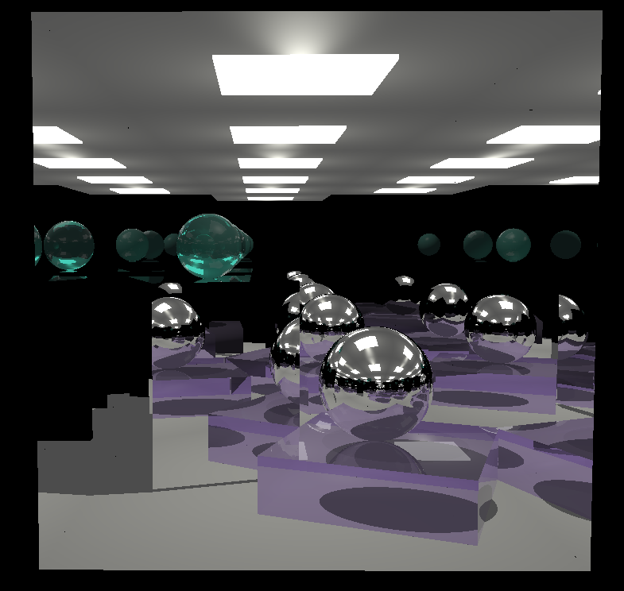

# Cornwall Room Ray Tracing

Учебный проект по рейтрейсингу: построение сцены **«Корнуэльская комната»**.

## О проекте

Сцена представляет собой “коробку-комнату” (большой куб со всеми гранями), внутри которой размещаются объекты (шары/кубы) и источники света.
Параметры рендера и сцены управляются через GUI.

## Реализовано

- Корнуэльская комната в виде большого куба (все грани присутствуют)
- Объекты в сцене: кубы и шары
- Дополнительные объекты разных типов
- Зеркальные отражения для объектов (можно включать/выключать)
- Прозрачность для объектов (можно включать/выключать)
- Зеркальная стена комнаты с возможностью выбора стены
- Дополнительный источник света с возможностью менять положение
- Загрузка объектов в сцену из файла

## Используемые библиотеки

- **SFML**
- **GLM**
- **ImGui**